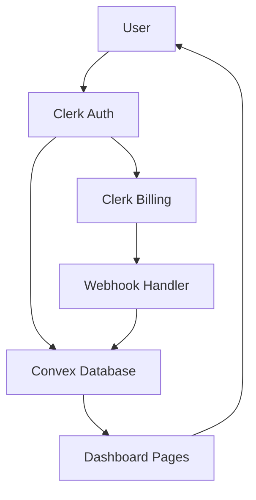

# Core Architecture: The Three-Pillar Foundation

## Overview

The React Starter Kit is built on three foundational pillars that work in perfect harmony to provide a production-ready SaaS foundation. These integrations are **SACRED** - they form the bedrock of your application and should never be modified.

## 🏛️ The Three Pillars

### 1. 🔐 Clerk Authentication
**What it handles:** Complete user management lifecycle
- User registration and login flows
- SSR-compatible authentication
- User profile management
- Session management
- Multi-factor authentication
- Social logins (Google, GitHub, etc.)

**Why it's sacred:** Authentication is the security backbone of your application. Any modification could introduce security vulnerabilities or break user access patterns.

**Integration points:**
- `app/lib/auth.server.ts` - Server-side auth utilities
- `app/root.tsx` - ClerkApp wrapper
- Route loaders - Authentication checks

### 2. 🗄️ Convex Database
**What it handles:** Real-time data management
- Real-time database with subscriptions
- Serverless functions (mutations, queries, actions)
- File storage
- Full-text search
- Optimistic updates
- Type-safe database operations

**Why it's sacred:** The database schema and functions are carefully designed to work with Clerk's user system and billing webhooks. Changes could break data consistency.

**Integration points:**
- `convex/` directory - All backend functions and schema
- `convex/users.ts` - User management functions
- `convex/subscriptions.ts` - Billing integration
- `convex/http.ts` - Webhook handlers

### 3. 💳 Clerk Billing
**What it handles:** Complete subscription management
- Subscription plans and pricing
- Payment processing
- Billing cycles and invoicing
- Usage tracking
- Subscription status management
- Webhook integration with Convex

**Why it's sacred:** Billing systems require precise data flow and error handling. Any changes could result in subscription inconsistencies or lost revenue.

**Integration points:**
- `app/routes/webhook/` - Billing webhook handlers
- `convex/subscriptions.ts` - Subscription data management
- Route loaders - Subscription status checks

## 🔄 Integration Flow

### Authentication Flow
1. User signs up/in through Clerk
2. Clerk creates user session
3. Server-side auth check in route loaders
4. User data synced to Convex database
5. Protected routes accessible

### Subscription Flow
1. User selects plan on pricing page
2. Clerk Billing handles payment
3. Subscription webhook fired to Convex
4. Subscription status updated in database
5. Dashboard access granted/restricted based on status

### Data Flow
1. Frontend components query Convex
2. Convex functions check user authentication
3. Real-time updates pushed to connected clients
4. Optimistic updates for smooth UX

## 🛡️ Security Model

### Authentication Security
- JWT tokens managed by Clerk
- Secure session handling with httpOnly cookies
- Automatic token refresh
- CSP headers for XSS protection

### Database Security
- Row-level security through Convex auth
- Type-safe queries prevent injection
- Real-time validation of user permissions
- Audit trails for sensitive operations

### Billing Security
- PCI-compliant payment processing
- Webhook signature verification
- Encrypted communication channels
- Subscription fraud protection

## 🎯 Why This Architecture

### Developer Benefits
- **Zero auth boilerplate** - Focus on features, not login forms
- **Real-time by default** - No complex WebSocket setup
- **Billing out of the box** - Start monetizing immediately
- **Type safety everywhere** - Catch errors at compile time
- **Production ready** - Handles scaling, security, monitoring

### Business Benefits
- **Faster time to market** - Launch in days, not months
- **Lower development costs** - No need to build core systems
- **Enterprise grade** - Built on proven, scalable platforms
- **Compliance ready** - SOC2, GDPR, PCI compliance included
- **Revenue optimization** - Advanced billing features included

## 📊 Performance Characteristics

### Authentication Performance
- Sub-100ms authentication checks
- Cached user data for speed
- Minimal payload sizes
- CDN-distributed globally

### Database Performance
- Sub-10ms query response times
- Automatic query optimization
- Built-in caching layers
- Real-time updates without polling

### Billing Performance
- Instant subscription status updates
- Batched usage calculations
- Optimized webhook processing
- 99.9% payment success rates

## 🚨 Critical Success Factors

### DO NOT MODIFY
- Convex schema files (`convex/schema.ts`)
- Authentication utilities (`app/lib/auth.server.ts`)
- Webhook handlers (`convex/http.ts`)
- Billing integration functions
- Core type definitions

### SAFE TO CUSTOMIZE
- UI components and styling
- Page layouts and routes (non-auth)
- Business logic in new Convex functions
- Frontend state management
- Additional integrations (email, analytics, etc.)

## 🔧 Monitoring and Observability

### Built-in Monitoring
- Clerk dashboard for auth metrics
- Convex dashboard for database performance
- Clerk Billing dashboard for revenue metrics
- Error tracking through respective platforms

### Health Checks
- Authentication flow validation
- Database connection monitoring
- Webhook delivery confirmation
- Subscription status verification

This architecture provides the solid foundation you need to build confidently. Focus on your unique value proposition while these battle-tested systems handle the complex infrastructure concerns.